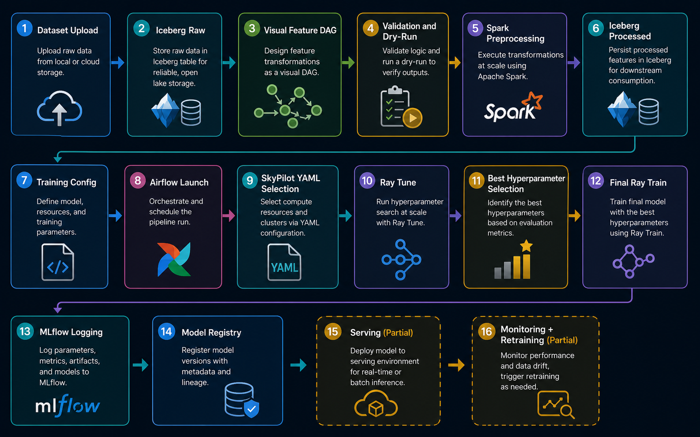
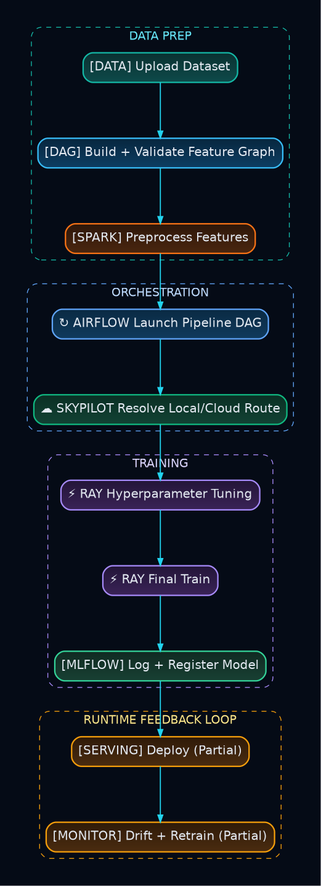
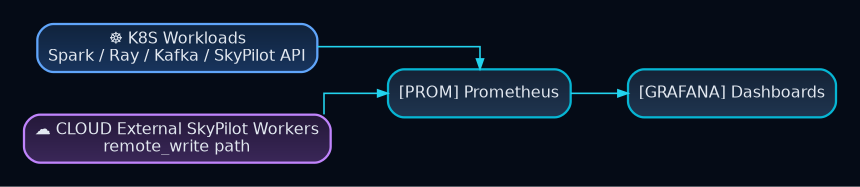
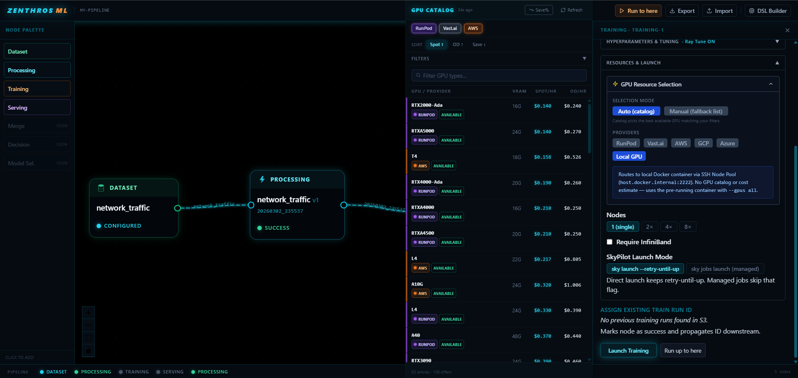
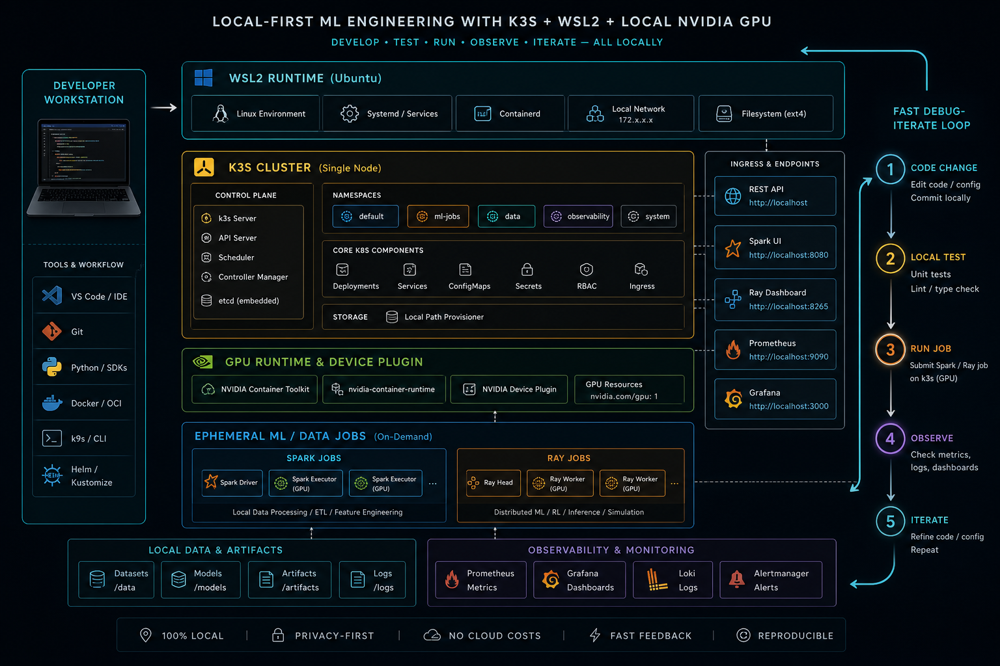
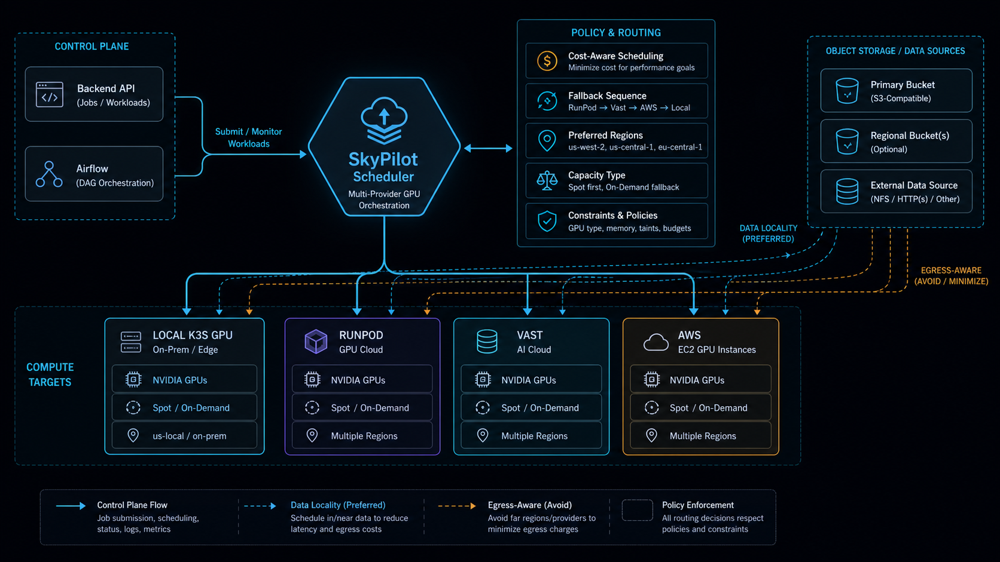

# ZENTHROS ML Platform

<p align="center">
  
  
  
  
  
  
  
  
  
  
  
</p>

**Lightweight, cost-aware MLOps and ML infrastructure platform for local k3s clusters and external GPU providers.**

## Quick Index
- [Executive Summary](#executive-summary)
- [Why This Project Exists](#why-this-project-exists)
- [What The Platform Does](#what-the-platform-does)
- [Current Status](#current-status)
- [Core Features](#core-features)
- [Infrastructure Decisions and Challenges Solved](#infrastructure-decisions)
- [What Makes This Different From Kubeflow / Managed Platforms](#what-makes-this-different-from-kubeflow--managed-platforms)
- [Architecture Deep Dive](#architecture-deep-dive)
- [Roadmap](#roadmap)

## Executive Summary
ZENTHROS ML Platform (this repository: `Kubernetes-MLOPS-platform`) is a hands-on platform engineering project focused on building and operating an end-to-end ML workflow with explicit control over infrastructure and compute cost.

<p align="center">
  
</p>

Implemented loop: ingest raw data to Iceberg, build and validate feature DAGs, preprocess with Spark, train with Ray (Tune + final Train), track in MLflow, and orchestrate local/remote GPU execution via SkyPilot.

Serving and continuous monitoring components exist, but are intentionally labeled **partial / under active development** rather than production-complete.

## Why This Project Exists
This project started as an engineering capstone to consolidate practical experience in:
- Kubernetes operations and workload orchestration
- GPU-aware ML infrastructure
- cost-aware remote execution
- reproducible data/model pipelines
- observability across distributed components

It evolved into a lightweight, modular MLOps platform exploration that stays explicit about trade-offs and operational constraints.

## What The Platform Does
- **Frontend**: React-based orchestration canvas and DSL graph authoring.
- **Backend**: FastAPI APIs for datasets, schemas, preprocessing/training/serving runs, and GPU resource selection.
- **Data Layer**: S3-backed Iceberg tables for raw and processed datasets.
- **Processing**: Spark jobs launched via SparkApplication and orchestrated via Airflow.
- **Training**: Ray Tune plus final Ray Train with MLflow tracking and registry flows.
- **GPU Orchestration**: SkyPilot templates/routing for local `k8s`, `runpod`, `vast`, and `aws` paths.
- **Observability**: Prometheus + Grafana stack with workload dashboards.
- **Streaming Demo**: Kafka producer + Spark streaming path + Ray Serve-style inference path.

## Current Status
Quick snapshot:
- `working`: **14 components** with repository evidence and active flow integration.
- `partial`: **3 components** with implemented pieces but no hardened end-to-end lifecycle.
- `planned`: **3 components** documented as direction, not stable platform capabilities yet.

Status definitions:
- `working`: implemented with repository evidence and integrated into active flows
- `partial`: implemented components exist, but end-to-end hardening/validation is incomplete
- `planned`: direction documented, not implemented as a stable platform capability

<details>
<summary><strong>Open full component-by-component status matrix (with evidence)</strong></summary>

| Component | Status | Notes |
|---|---|---|
| React orchestration canvas + DAG UX | working | `app/frontend/src/pages/OrchestrationCanvasPage.tsx`, `app/frontend/src/store/dagStore.ts` |
| Visual feature engineering DAG builder | working | `app/frontend/src/components/Canvas/CanvasPanel.tsx`, `app/frontend/src/store/pipelineStore.ts` |
| Backend validation + dry-run endpoints | working | `app/backend/main.py` (`/api/dry-run`, `/api/validate-yaml`) |
| Dataset upload and Iceberg ingest path | working | `app/backend/routers/datasets.py`, `k3s/spark/ingestion/ingestion_main.py` |
| Spark preprocessing orchestration | working | `k3s/airflow/dags/preprocessing_dag.py`, `k3s/spark/spark-application.yaml` |
| Ray Tune + final Ray Train flow | working | `src/pipeline/base_tuner.py`, `src/pipeline/base_trainer.py`, `k3s/kuberay/main.py` |
| MLflow tracking + registry integration | working | `src/pipeline/utils/mlflow_utils.py`, `k3s/mlflow/mlflow_values.yaml` |
| SkyPilot remote training orchestration | working | `k3s/airflow/dags/training_dag_skypilot.py`, `app/backend/services/job_builder.py` |
| SkyPilot local k3s GPU path | working | `training_dag_skypilot.py` provider routing + `k3s/sky/ray-gpu-training-k8s.yaml` |
| Grafana + Prometheus dashboards | working | `k3s/monitoring/prometheus/prometheus-stack.yaml`, `k3s/monitoring/grafana/grafana.yaml`, `k3s/monitoring/grafana/dashboards/*` |
| Kafka streaming demo path | working | `producer/producer.py`, `k3s/spark/inference/kafka_main.py`, `k3s/kafka/*` |
| Local k3s development workflow | working | `k3s/up-k3s-gpu.sh`, `k3s/down-k3s-gpu.sh`, `k3s/deploy.sh`, `k3s/README-k3s-gpu.md` |
| MLflow + PostgreSQL via Helm values | working | `k3s/mlflow/mlflow_values.yaml`, `k3s/mlflow/postgres_values.yaml` |
| Ingress-based UI exposure | working | `k3s/ingress/values.yaml`, `k3s/update-win-hosts.sh` |
| Serving pipeline (Ray/SkyServe/vLLM paths) | partial | APIs + DAGs + templates exist, not documented as production-complete |
| Continuous monitoring / drift loop | partial | prototype code exists (`evidentlyIA.py`), not integrated as stable platform loop |
| Continuous retraining automation | partial | building blocks exist in Airflow + training APIs, no fully automated closed loop |
| Deeper SkyPilot optimization | planned | tuning/operational hardening still ongoing |
| Faster env setup with broader `uv` adoption | planned | only limited usage (e.g., `producer/Dockerfile`) |
| Cloudflare R2 as primary storage backend | planned | not implemented as platform default |

</details>

## End-To-End ML Pipeline
<p align="center">
  
</p>

## Training Orchestration Path
<p align="center">
  
</p>

## Observability Path
<p align="center">
  
</p>

## Visual Feature Engineering DAG
Implemented:
- Drag-and-drop DAG model with typed node contracts and edge selectors.
- Frontend graph validation plus backend dry-run validation before expensive jobs.

Trade-off:
- Rich client-side DAG/state logic increases complexity and requires strict frontend/backend validator parity.

Current status:
- `working` for DAG authoring and validation hooks.
- Deep dive: [Feature Engineering DAG](./project-docs/feature-engineering-dag.md)

Real UI evidence (GPU selection + DAG view):
<p align="center">
  
</p>

## Infrastructure Decisions and Challenges Solved
### 1) k3s instead of Docker Desktop KubeAdm

Local runtime scripts and docs center on k3s GPU flows (`k3s/up-k3s-gpu.sh`, `k3s/README-k3s-gpu.md`) with explicit GPU runtime and device-plugin setup. The reason why this change was made is due to Kubernetes in Docker-Desktop using WSL2 has no support for GPU workloads but k3s does support GPU workloads in WSL2

### 2) Ray Operator -> SkyPilot migration (architectural evolution)
First version used KubeRay (Ray Operator) natively on k8s. It was CPU-only and depended entirely on cluster-local resources.

The Docker Desktop GPU issue was eventually worked around, but a deeper problem remained: even with a working k8s cluster (e.g. kube-hetzner), GPU nodes were unavailable or prohibitively expensive — Hetzner has no GPU on-demand nodes. This made the Ray Operator path a dead end for any cluster without local GPUs, so the architecture migrated to SkyPilot as the GPU orchestration abstraction, decoupling training from the underlying cluster's GPU inventory.

Downside: the serving architecture was tightly coupled to Ray Operator’s native RayService workflow. Migrating to SkyPilot introduced major architectural changes that left the serving stack only partially functional. Although the pipeline worked before the migration, recovery was never fully completed afterward. The transition also introduced dependency on SkyServe, which is still relatively immature according to its current official documentation.

### 3) Running SkyPilot Jobs Locally on Kubernetes

- Local GPU debugging and remote provider execution share the same orchestration flow, ensuring local runs behave as close as possible to remote execution and reducing expensive cloud debugging cycles.
- One of the hardest parts of the infrastructure was making SkyPilot run reliably on a local Kubernetes environment. During development, a SkyPilot Kubernetes bug caused Ray/SkyPilot workloads to ignore proper CPU and RAM limits, which saturated the host node and significantly slowed down the entire machine during local execution.
- Multiple approaches were tested to support local GPU execution, including SSH Node Pools with Docker Desktop containers acting as VM-like workers. However, WSL2 networking, GPU passthrough, and orchestration complexity became difficult to maintain, which ultimately motivated the migration toward a k3s-based local Kubernetes setup.

### 4) Faster setup and iteration with `uv` and prebuilt images

- Reduced environment startup time from roughly 7–8 minutes to around 2–3 minutes by using prebuilt CUDA/PyTorch images from the GPU provider and only installing the remaining project dependencies at runtime.
- Additional setup-time improvements for local Kubernetes jobs were achieved by storing Docker images directly inside the local k3s/containerd registry, allowing workloads to pull images from the local cluster registry instead of repeatedly downloading them from remote registries during development and testing iterations.

### 5) Idle-light architecture

- Spark and Ray workloads are launched as ephemeral Kubernetes resources (`SparkApplication`, `RayJob`) instead of maintaining permanently running training clusters.
- This reduces idle CPU, memory, and GPU consumption on the cluster by only allocating distributed resources during active execution.

Trade-off:
- Lower idle resource footprint at the cost of additional orchestration and startup latency during workload initialization and teardown.

### 6) Scripts-first operations (for now)

- `k3s/*.sh` scripts are the primary bootstrap/deploy workflow for rapid local iteration.

<p align="center">
  
</p>

Trade-off:
- Fast local iteration, but less declarative reconciliation than full Terraform/GitOps workflows.

## What Makes This Different From Kubeflow / Managed Platforms
This project is intentionally lighter and more transparent than full platform products.

| Area | ZENTHROS ML Platform | Kubeflow | Managed Cloud ML Platforms |
|---|---|---|---|
| Main goal | Infrastructure-aware, local+remote experimentation | Full Kubernetes-native ML platform suite | Fast cloud-native productivity |
| Local development | Strong local path (`k3s`, WSL2, scripts) | Possible but operationally heavy | Usually cloud-first |
| GPU strategy | Local GPU + external providers via SkyPilot | Mostly cluster/cloud provisioning workflows | Vendor-native GPU services |
| Vendor lock-in | Explicitly minimized via Kubernetes + SkyPilot abstractions | Medium (K8s portable, but ops heavy) | Higher lock-in by design |
| Infra visibility | High (YAML/scripts/manifests exposed) | High but complex | Lower (many managed internals) |
| Operational weight | Moderate | High | Low-to-moderate for user, high provider abstraction |
| Best fit | Engineers wanting control and portability | Teams needing full K8s ML control plane | Teams prioritizing speed over infra control |

## Architecture Deep Dive
Detailed docs:
- [Architecture](./project-docs/architecture.md)
- [Data Layer](./project-docs/data-layer.md)
- [Feature Engineering DAG](./project-docs/feature-engineering-dag.md)
- [Training](./project-docs/training.md)
- [Serving](./project-docs/serving.md)
- [Observability](./project-docs/observability.md)
- [Local Development](./project-docs/local-development.md)
- [Cloud Deployment Direction](./project-docs/cloud-deployment.md)
- [Cost & Vendor Lock-in](./project-docs/cost-and-vendor-lock-in.md)
- [Synthetic Data & Drift](./project-docs/synthetic-data-and-drift.md)

## Data Layer
Implemented:
- Raw dataset upload paths into object storage prefixes (`raw/{dataset}/...`).
- Spark ingestion into Iceberg raw namespaces.
- Processing lineage and schema references in run APIs.

Trade-off:
- Current wiring is S3/Glue-centric, so adding alternative object storage backends needs explicit adapter work.

Current status:
- `working` for S3-backed Iceberg paths, with storage diversification as `planned`.
- Deep dive: [Data Layer](./project-docs/data-layer.md)

## Training Layer
Implemented:
- Hyperparameter search via Ray Tune.
- Final training via Ray Train.
- MLflow tracking, artifacts, and registry alias flows.

Current status:
- `working` core training lifecycle; broader retraining automation remains `partial`.
- Deep dive: [Training](./project-docs/training.md)

## GPU Orchestration And SkyPilot
<p align="center">
  
</p>

Implemented:
- Provider-aware template routing for local `k8s`, `runpod`, `vast`, and `aws` paths.

Current status:
- `working` for orchestration selection logic and templates; deeper provider optimization is `planned`.
- Deep dive: [Cost And Vendor Lock-In](./project-docs/cost-and-vendor-lock-in.md), [Cloud Deployment Direction](./project-docs/cloud-deployment.md)

## Observability
Implemented:
- Prometheus scraping across Spark, Ray, Kafka, node, and Kubernetes metrics.
- Grafana provisioning for training/inference/resource dashboards.

Trade-off:
- In-cluster monitoring is straightforward; external SkyPilot workers require extra metrics shipping patterns.

Current status:
- `working` in-cluster observability with external-worker coverage still `partial`.
- Deep dive: [Observability](./project-docs/observability.md)

## Streaming / Kafka Demo
Implemented:
- Synthetic producer emits traffic events.
- Spark streaming transforms/routes events.
- Inference path aligns with Ray Serve-style endpoint workflows.

Trade-off:
- Excellent for latency and event-driven experimentation, but not yet positioned as a production serving SLA path.

Current status:
- `working` demo workflow.

## Synthetic Data And Drift Simulation
Implemented:
- Synthetic generator supports `normal`, `data_drift`, and `concept_drift` modes.

Trade-off:
- Drift simulation is useful for controlled experimentation, but not a replacement for production monitoring governance.

Current status:
- `working` generator + `partial` monitoring integration.
- Deep dive: [Synthetic Data & Drift](./project-docs/synthetic-data-and-drift.md)

## Cloud Deployment Direction
Implemented:
- Provider-specific SkyPilot templates and selection logic in repository code.

Current status:
- `partial` direction with active evolution.
- Deep dive: [Cloud Deployment Direction](./project-docs/cloud-deployment.md)

## Cost-Aware, Vendor-Lock-In-Aware Design
Implemented:
- Local-first debugging to reduce expensive remote iterations.
- Provider abstraction layers to avoid single-provider coupling.

Trade-off:
- Data egress and data locality can become dominant constraints in multi-provider execution.

Current status:
- `working` design principle in current orchestration model; deeper automation is `planned`.
- Deep dive: [Cost And Vendor Lock-In](./project-docs/cost-and-vendor-lock-in.md)

## Tech Stack
- **Frontend**: React, TypeScript, Zustand, ReactFlow
- **Backend**: FastAPI, Pydantic, boto3
- **Data/Compute**: Spark, Iceberg, Ray Tune, Ray Train
- **Orchestration**: Airflow, SkyPilot
- **Infra**: k3s, Helm, Kubernetes manifests, Docker
- **Streaming**: Kafka (Strimzi)
- **Observability**: Prometheus, Grafana
- **Experiment Tracking**: MLflow + PostgreSQL

## Repository Structure
```text
app/                 frontend + backend APIs
src/                 ML, DSL, serving, services, utilities
k3s/                 manifests, DAGs, scripts, Helm values
producer/            synthetic traffic + Kafka producer
tests/               backend/service test coverage
docs/                engineering notes and migration docs
project-docs/        recruiter-grade architecture documentation
```

## Roadmap
- Harden serving path with stronger lifecycle, promotion, and rollback safety.
- Close monitoring-to-retraining loop with clear automation boundaries.
- Improve setup/runtime efficiency and dependency workflows.
- Expand repeatable cloud bootstrap patterns with clearer operational runbooks.
- Improve cross-provider data locality strategy to reduce egress overhead.
