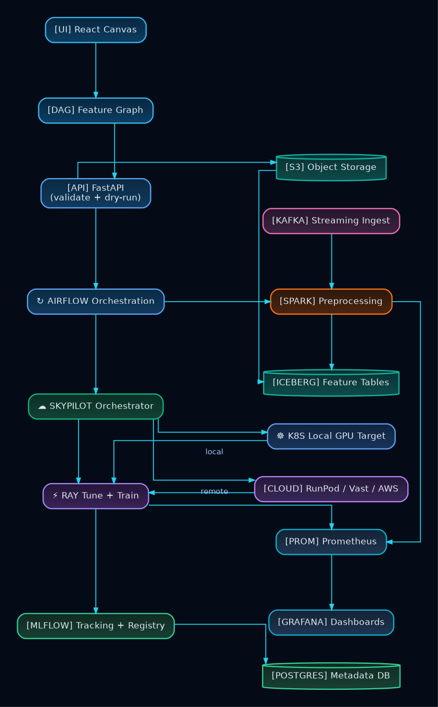

# Architecture

## Status
- `working`: data ingestion, preprocessing, training orchestration, MLflow logging, monitoring stack
- `partial`: serving lifecycle, monitoring-to-retraining closure
- `planned`: full production deployment automation and cloud bootstrap patterns

## System Shape
Core runtime chain:
1. UI builds orchestration + DSL metadata.
2. Backend persists run configs and triggers Airflow DAGs.
3. Airflow submits Spark/SkyPilot workloads.
4. Spark + Ray execute preprocessing and training.
5. MLflow tracks runs and model lineage.
6. Prometheus/Grafana provide system visibility.

## Architectural Decisions
- Separate preprocessing and training flows to preserve artifact lineage and rerun flexibility.
- Keep compute jobs mostly ephemeral (`SparkApplication`, `RayJob` patterns) to limit idle footprint.
- Use provider-aware orchestration selection rather than one fixed cloud path.
- Keep frontend graph modeling explicit so users can inspect and control execution decisions.

## Trade-Offs
- Script-driven ops accelerate local iteration but reduce declarative convergence guarantees.
- Multi-provider support improves portability but increases configuration complexity.
- Local-first mode lowers costs, but reproducibility across external providers requires extra discipline.

## Evidence Pointers
- `app/backend/routers/jobs.py`
- `app/backend/services/orchestration_selector.py`
- `k3s/airflow/dags/preprocessing_dag.py`
- `k3s/airflow/dags/training_dag_skypilot.py`
- `k3s/deploy.sh`
