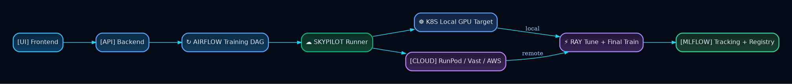

# Training

## Status
- `working`: Ray Tune + Ray Train lifecycle with MLflow integration
- `partial`: full provider-hardening and automated retraining loops

## Design
- Tuning and final training are separated in shared base abstractions.
- Training orchestration runs through Airflow + SkyPilot.
- Provider routing uses resource constraints and template selection.
- MLflow tracks metrics/artifacts and model registry versions/aliases.

## Infrastructure Decision
SkyPilot is used to target local k3s GPU, RunPod/Vast paths, and AWS templates without coupling training logic to a single runtime.

## Trade-Offs
- Multiple execution environments increase integration surface area.
- Credential forwarding and remote setup consistency require careful ops discipline.

## Evidence Pointers
- `src/pipeline/base_tuner.py`
- `src/pipeline/base_trainer.py`
- `k3s/kuberay/main.py`
- `k3s/airflow/dags/training_dag_skypilot.py`
- `src/pipeline/utils/mlflow_utils.py`
